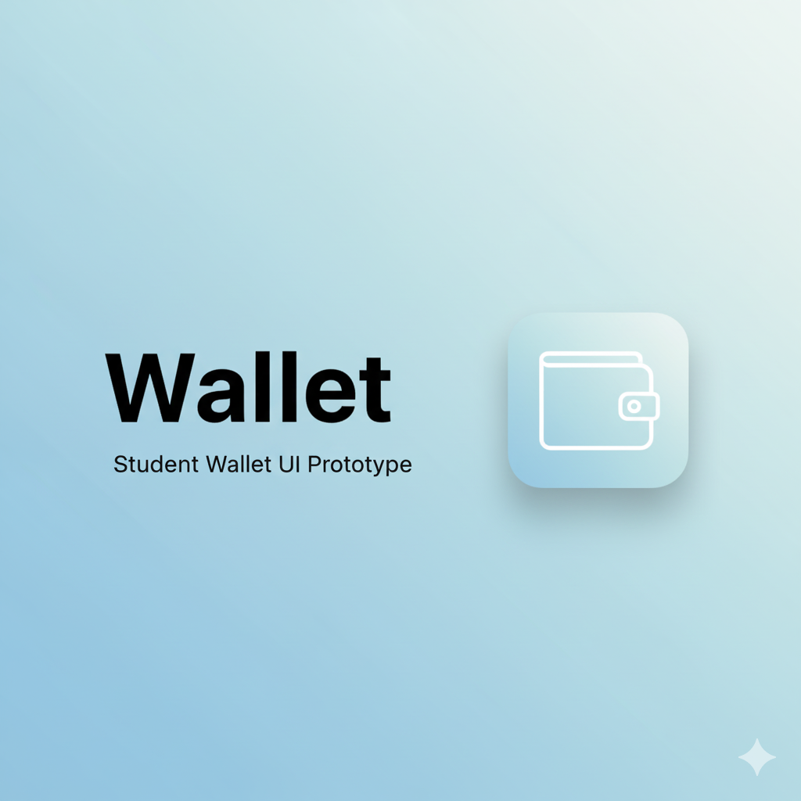

<p align="center">
  
</p>

# 🚀 Wallet — Student Wallet UI Prototype  
A clean, minimal, Apple-style interface for a **parent-controlled student allowance wallet**.

<p align="center">
  
</p>

---

## ✨ Tagline  
A beautifully designed student wallet concept — where **parents manage allowances** and **students track spending**.

## 📖 Description  
This project is a **UI/UX design prototype**, not a working financial application.  
It demonstrates the front-end look and feel of a **simple student wallet**:

- Students can view balances  
- Parents can (conceptually) add funds  
- Spending is monitored  
- Limits can be controlled  

This prototype is ideal for presentations, design demonstrations, and future feature planning.

👉 **Live Demo:** https://mrinal140420.github.io/wallet/

---

## 📸 Preview


---

## 🔥 Features (Design Level Only)

- 🎒 Student Dashboard UI  
- 👨‍👩‍👦 Parent-Controlled Allowances  
- 💳 Balance Card Design  
- 📝 Simple Transaction-Like Display  
- 📱 Mobile-Friendly Minimal Layout  

> ❗ This is a visual prototype — no backend, no wallet logic, no payments.

---

## 🛠️ Tech Stack  
- **HTML5** - **CSS3** - **Vanilla JavaScript (minimal)** - No React, No frameworks, No build tools

---

## 📦 Installation (Optional)  
You can run this as a simple static site:

```sh
git clone https://github.com/mrinal140420/wallet.git
cd wallet
````

Then open:
`index.html`
in any browser.

## 🤝 Contributing

Want to improve the design? Follow the typical GitHub flow:

1.  Fork the repository
2.  Create a feature branch (`git checkout -b feature/AmazingDesign`)
3.  Commit your changes (`git commit -m 'Add some AmazingDesign'`)
4.  Push to the branch (`git push origin feature/AmazingDesign`)
5.  Open a Pull Request

## 🪪 License

This project is not licensed.

All rights reserved by the owner.

## 📞 Contact

Mrinal Sahoo

GitHub: https://github.com/mrinal140420

